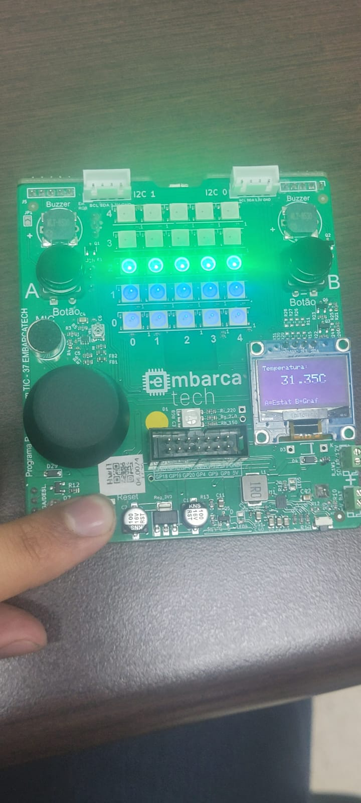
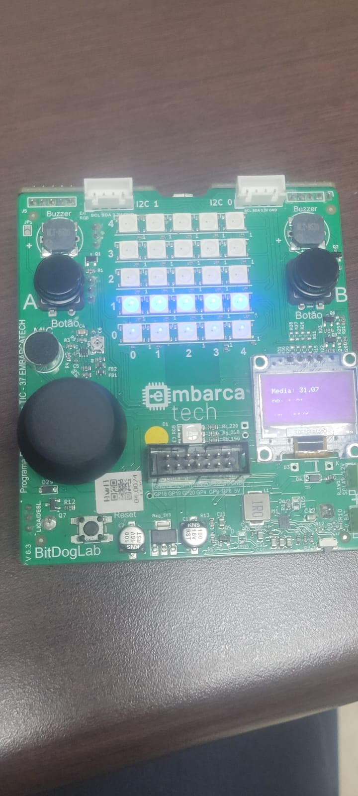
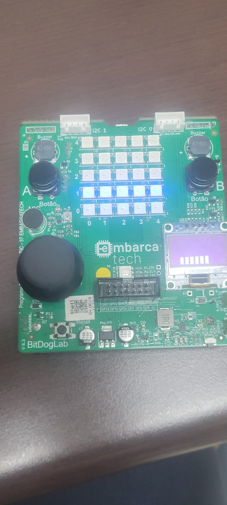

# Visualizador de Temperatura com FreeRTOS

Autor: **João Magno e Guilherme Achilles**

Curso: Residência Tecnológica em Sistemas Embarcados

Instituição: EmbarcaTech - HBr

Brasília, junho de 2025

---
## Vídeo do projeto

## Fotos do projeto

## Visão Geral
Este documento detalha a arquitetura e implementação de um sistema embarcado multitarefa desenvolvido sobre o sistema operacional de tempo real (RTOS) FreeRTOS. O objetivo principal do projeto é realizar a aquisição de dados de temperatura do sensor interno do microcontrolador e apresentar essa informação de forma contínua e visual através de uma matriz de diodos emissores de luz (LEDs).
A funcionalidade é modularizada em duas tarefas concorrentes que se comunicam de forma assíncrona, demonstrando um padrão de design produtor-consumidor para garantir a integridade dos dados e a eficiência do sistema.

## Camada de Abstração de Hardware (HAL):
Esta camada isola a aplicação principal dos detalhes de baixo nível do hardware. Funções como a leitura do ADC e o controle da matriz de LEDs são encapsuladas aqui, permitindo que a lógica de negócio em main.c permaneça agnóstica ao hardware subjacente.

## Funcionalidades Implementadas
O sistema executa duas tarefas principais de forma concorrente:
 ### Tarefa de Aquisição de Dados: 
 Responsável por ler periodicamente o conversor analógico-digital (ADC) associado ao sensor de temperatura. O valor adquirido é então enviado, através de um mecanismo de comunicação seguro, para a tarefa de visualização.
 ### Tarefa de Visualização: 
 Permanece em estado de bloqueio aguardando a recepção de um novo dado de temperatura. Ao recebê-lo, realiza o processamento necessário para mapear o valor escalar de temperatura a uma representação gráfica na matriz de LEDs. Essa representação consiste em uma barra cujo preenchimento e coloração variam proporcionalmente à temperatura.
## Requisitos de Hardware e Procedimento de Execução
 ### Hardware: 
 Placa de desenvolvimento BitDogLab ou Raspberry Pi Pico, equipada com uma matriz de LEDs RGB e sensor de temperatura interno.
 ### Toolchain: 
 Ambiente de desenvolvimento configurado para o SDK do Raspberry Pi Pico, utilizando VSCode ou similar.
 
 ## Procedimento de Execução:
   * Assegure que o arquivo CMakeLists.txt do projeto esteja configurado para vincular as bibliotecas do FreeRTOS-Kernel e FreeRTOS-Pico.
   * Compile o projeto e realize o flash do firmware na placa de desenvolvimento.
   * A matriz de LEDs iniciará a exibição da representação gráfica da temperatura após a inicialização do sistema.
## Conceitos Técnicos Aplicados
### O Kernel do FreeRTOS e o Escalonamento de Tarefas
O FreeRTOS é um sistema operacional de tempo real cujo kernel é responsável por gerenciar os recursos do sistema, primariamente o tempo de CPU. Uma tarefa (Task) é a unidade mínima de execução, representando um fluxo de controle independente com sua própria pilha e contexto.
O Escalonador (Scheduler) é o componente do kernel que implementa a política de escalonamento. Ele determina qual tarefa deve ser executada em cada instante, realizando trocas de contexto para criar a concorrência. Neste projeto, a política de escalonamento para tarefas de mesma prioridade é o Round-Robin com Time-Slicing, onde cada tarefa recebe uma fatia de tempo da CPU antes que o controle seja passado para a próxima tarefa no estado "Pronto".

### Análise de Consumo de CPU
O design do sistema é inerentemente eficiente em termos de consumo de CPU. Ambas as tarefas, passam a maior parte de seu ciclo de vida no estado Bloqueado, aguardando a expiração de um temporizador (vTaskDelay) ou a chegada de um dado em uma fila (xQueueReceive). O uso da CPU ocorre apenas em breves picos de atividade, resultando em baixo consumo de energia e alta eficiência do processador.
### Análise Comparativa: Sistema Baseado em RTOS vs. Super-Loop Sequencial
A implementação desta funcionalidade em um sistema sem RTOS, tipicamente através de um laço sequencial único (super-loop), apresentaria desvantagens significativas:
 * Natureza Bloqueante: Funções com tempo de execução variável ou longo, como a atualização da matriz de LEDs, monopolizariam o processador, impedindo a execução de outras lógicas e degradando a responsividade do sistema.
 * Baixa Modularidade: A adição de novas funcionalidades implicaria em modificações complexas no laço principal, aumentando o acoplamento entre os componentes do software e dificultando a manutenção.
 * Temporização Imprecisa: A latência de resposta a eventos externos seria dependente do tempo de execução total do laço, resultando em um comportamento temporal não determinístico. O RTOS, por outro lado, permite a criação de tarefas responsivas e independentes, fundamentais para sistemas de tempo real.

---

## 📜 Licença
GNU GPL-3.0.
